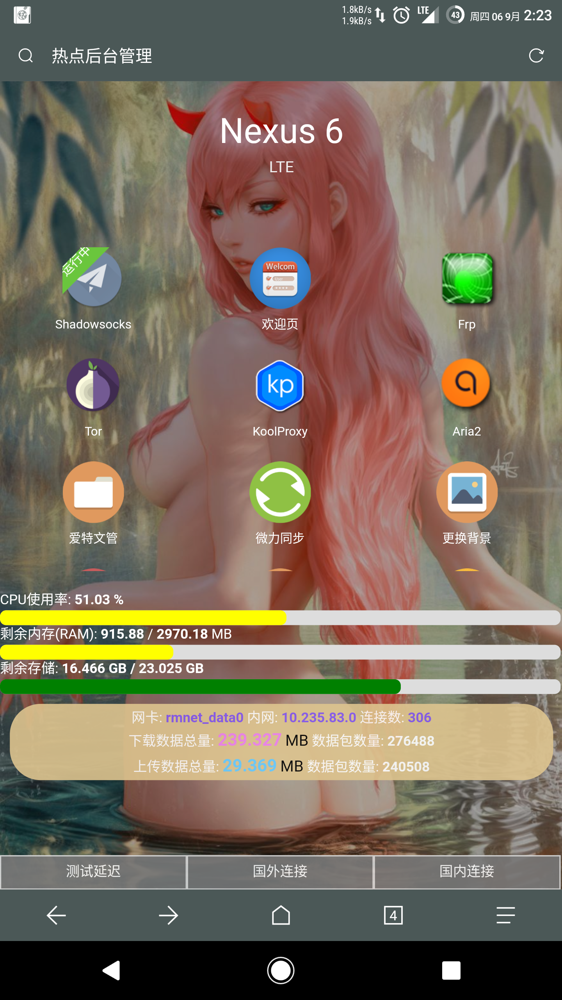
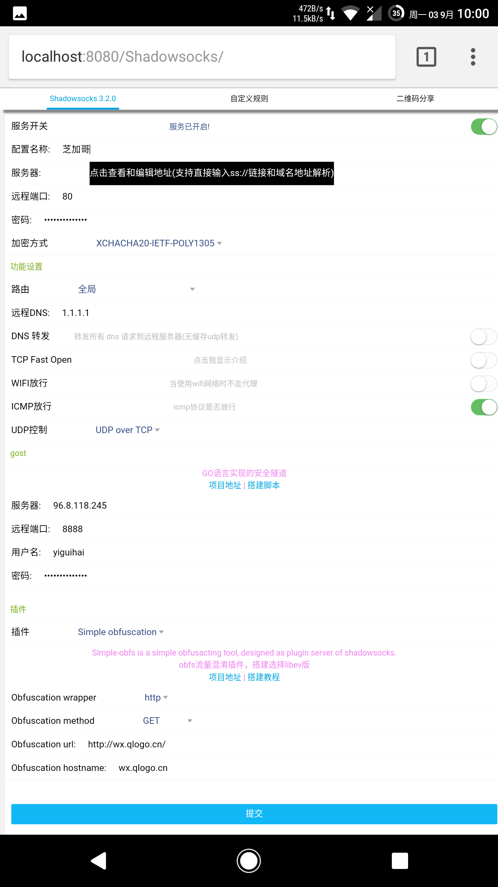

# hotspot-tethering
## 安卓热点管理 
     
后台管理地址为 http://localhost:8080/Admin/  
用户名和密码都是 __admin__ 放在 **/Admin/admin.php**  
~~手机 -> 路由器中继 -> 热点机~~  
暂时没找到方法  
     
### 推荐环境配置
- ksweb安卓版
- Root权限
- 支持TPTOXY
- php7.0+
- 配置好https

### 未来开发目标计划  
- [ ] 优化 main.class.php 删除一些函数。
- [ ] 分应用代理破解版权认证 (动画疯)
- [ ] 增加日志显示 shadowsocks dnsforwarder日志显示。 

已经有测试机不再闭门造车了，即将修复热点联网问题、删除本机代理只做热点代理。
请注意防止热点机不必要的软件联网问题，以防流量走失！！！

以lighttpd为例:  
为了节省时间我已经用Termux制作好了一个https证书(`lighttpd.pem`)
只需要在lighttpd.conf写入如下配置，即可
```
$SERVER["socket"] == ":4433" { 
ssl.engine = "enable" 
ssl.pemfile = "/sdcard/lighttpd.pem" 
}
```
其中 lighttpd.pem 是你的证书存放绝对路径，例子中是放到sd卡目录下  
然后测试 https://localhost:4433 是否可以访问? aria2使用https访问有点问题需要自己修改配置支持
```
server.error-handler-404 = "/" 
```
再添加一个404的出错页面，这样用户访问任何域名都会跳转到我们的认证页面。  

```
openssl req -x509 -out localhost.crt -keyout localhost.key -days 365 \
  -newkey rsa:4096 -nodes -sha512 \
  -subj '/CN=localhost' -extensions EXT -config <( \
   printf "[dn]\nCN=localhost\n[req]\ndistinguished_name = dn\n[EXT]\nsubjectAltName=DNS:localhost\nkeyUsage=digitalSignature\nextendedKeyUsage=serverAuth")
```
快速制作证书

iptables流量定向  
--------  

流量类型  | 源地址/端口 | 目标地址/端口 |
--------- | --------| --------- |
http  | 80 8080 | 8080 |
https  | 443 | 4433 | 
所有  | 192.168.0.0/16 | 127.0.0.1 |    

[](https://mobile.twitter.com/QXGFW)

     
          

# 预览图
  
  

:underage:
